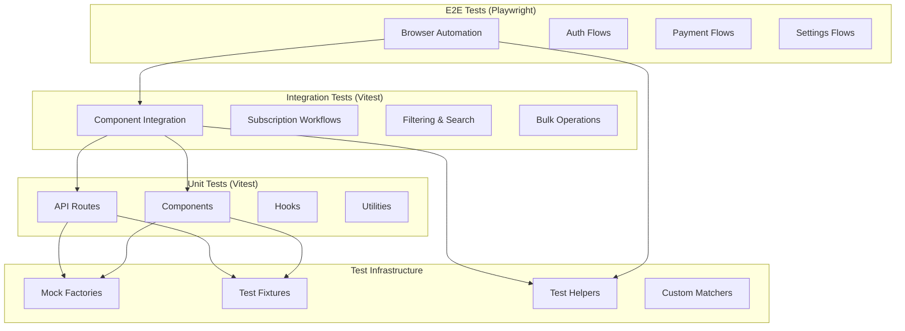
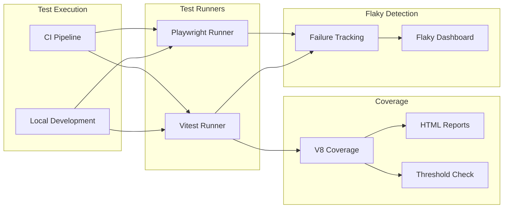

# Design Document: Client Test Coverage Enhancement

## Overview

This design establishes comprehensive test coverage for the client application, addressing the current minimal test footprint. The system will introduce unit tests for API routes, integration tests for component interactions, and expanded E2E tests for critical user journeys. The architecture focuses on three testing layers: API route testing (Next.js API handlers), component testing (React UI components), and E2E testing (Playwright browser automation).

### Current State

The existing test infrastructure includes:
- **Unit Tests**: Minimal coverage with vitest (onboarding tour component, auth middleware)
- **E2E Tests**: Basic Playwright tests (auth flow, subscription CRUD operations)
- **Test Configuration**: Vitest for unit tests, Playwright for E2E, Storybook with vitest integration
- **Coverage Reporting**: Not configured

### Target State

The enhanced test system will provide:
- **Comprehensive API Route Coverage**: Tests for all endpoints in `/app/api` (payments, webhooks, subscriptions, analytics, tags)
- **Component Test Suite**: Tests for critical UI components (subscription cards, notifications, charts, modals, forms)
- **Expanded E2E Tests**: Complete user journey coverage (signup, email connection, payment flows, MFA, data export)
- **Coverage Enforcement**: CI pipeline integration with minimum thresholds (70% line, 65% branch, 75% function)
- **Test Utilities**: Reusable mocks, fixtures, and helpers for efficient test authoring
- **Flaky Test Detection**: Automated tracking and reporting of unreliable tests

### Design Principles

1. **Test Pyramid**: Favor unit tests over integration tests, integration tests over E2E tests
2. **Isolation**: Tests should not depend on external services or shared state
3. **Determinism**: Tests must produce consistent results across runs
4. **Maintainability**: Use shared utilities and clear naming conventions
5. **Fast Feedback**: Unit tests run in milliseconds, integration tests in seconds, E2E tests in minutes

## Architecture

### Testing Layers



### Component Architecture



## Components and Interfaces

### 1. API Route Test Infrastructure

**Purpose**: Provide comprehensive testing for Next.js API route handlers

**Structure**:
```
client/app/api/__tests__/
├── payments/
│   ├── route.test.ts
│   └── fixtures.ts
├── webhooks/
│   ├── stripe.test.ts
│   └── fixtures.ts
├── subscriptions/
│   ├── route.test.ts
│   ├── [id]/route.test.ts
│   └── fixtures.ts
├── analytics/
│   └── route.test.ts
└── tags/
    └── route.test.ts
```

**Key Interfaces**:
```typescript
// Test helper for API routes
interface ApiTestContext {
  request: MockNextRequest
  user: MockUser
  supabase: MockSupabaseClient
}

// Mock request builder
interface MockRequestBuilder {
  withAuth(user: MockUser): MockRequestBuilder
  withBody(body: unknown): MockRequestBuilder
  withQuery(params: Record<string, string>): MockRequestBuilder
  build(): NextRequest
}

// Response assertion helpers
interface ApiResponseMatchers {
  toHaveStatus(status: HttpStatus): void
  toHaveSuccessResponse(data?: unknown): void
  toHaveErrorResponse(code: ErrorCode): void
  toMatchPaginatedResponse(schema: z.ZodType): void
}
```

**Testing Approach**:
- Mock Supabase client for database operations
- Mock Stripe client for payment operations
- Test authentication/authorization logic
- Verify request validation (Zod schemas)
- Test error handling and edge cases
- Verify response structure and status codes

### 2. Payment and Webhook Test Suite

**Purpose**: Ensure payment processing and webhook handling work correctly

**Structure**:
```
client/lib/__tests__/
├── payment-service.test.ts
├── stripe-config.test.ts
└── mocks/
    ├── stripe-mock.ts
    └── webhook-events.ts
```

**Key Test Scenarios**:
- Webhook signature validation
- Payment intent creation and confirmation
- Subscription upgrade/downgrade with proration
- Payment failure handling and retry logic
- Idempotency for duplicate webhook events
- Audit logging for payment operations

**Mock Strategy**:
```typescript
// Stripe webhook event factory
interface WebhookEventFactory {
  paymentIntentSucceeded(metadata: PaymentMetadata): Stripe.Event
  paymentIntentFailed(reason: string): Stripe.Event
  subscriptionUpdated(changes: SubscriptionChanges): Stripe.Event
}

// Payment service mock
interface MockPaymentService {
  processPayment: jest.Mock
  createPaymentIntent: jest.Mock
  handleWebhook: jest.Mock
}
```

### 3. Settings and Security Flow Tests

**Purpose**: Verify user preferences, MFA, and security features

**Structure**:
```
client/app/settings/__tests__/
├── notifications.test.tsx
├── budget.test.tsx
├── mfa-setup.test.tsx
├── mfa-verify.test.tsx
├── security.test.tsx
└── data-export.test.tsx
```

**Test Coverage**:
- Notification preference updates and persistence
- Budget limit validation and database updates
- MFA TOTP generation and QR code display
- MFA token validation and session management
- Password requirements and session invalidation
- CSV data export generation and privacy compliance

**Component Test Pattern**:
```typescript
describe('MFA Setup Flow', () => {
  it('generates TOTP secret and displays QR code', async () => {
    const { user } = renderWithAuth(<MFASetup />)
    
    await user.click(screen.getByRole('button', { name: /enable mfa/i }))
    
    expect(screen.getByTestId('qr-code')).toBeInTheDocument()
    expect(screen.getByText(/backup codes/i)).toBeInTheDocument()
  })
  
  it('validates TOTP token before enabling', async () => {
    const { user } = renderWithAuth(<MFASetup />)
    
    await user.type(screen.getByLabelText(/verification code/i), '123456')
    await user.click(screen.getByRole('button', { name: /verify/i }))
    
    expect(mockMfaService.verifyToken).toHaveBeenCalledWith('123456')
  })
})
```

### 4. Critical Component Test Suite

**Purpose**: Test essential UI components for correctness and accessibility

**Structure**:
```
client/components/__tests__/
├── subscription-card.test.tsx
├── notifications-panel.test.tsx
├── spend-chart.test.tsx
├── modals/
│   ├── add-subscription.test.tsx
│   ├── edit-subscription.test.tsx
│   └── delete-confirmation.test.tsx
└── forms/
    ├── subscription-form.test.tsx
    └── settings-form.test.tsx
```

**Testing Patterns**:
- Render testing with React Testing Library
- User interaction simulation
- Accessibility testing (ARIA attributes, keyboard navigation)
- Responsive behavior verification
- Dark mode support testing
- Loading and error states

**Example Test**:
```typescript
describe('SubscriptionCard', () => {
  const mockSubscription = {
    id: '1',
    name: 'Netflix',
    price: 15.99,
    billingCycle: 'monthly',
    status: 'active'
  }
  
  it('displays subscription information', () => {
    render(<SubscriptionCard subscription={mockSubscription} />)
    
    expect(screen.getByText('Netflix')).toBeInTheDocument()
    expect(screen.getByText('$15.99')).toBeInTheDocument()
    expect(screen.getByText(/monthly/i)).toBeInTheDocument()
  })
  
  it('handles edit action', async () => {
    const onEdit = jest.fn()
    const { user } = render(
      <SubscriptionCard subscription={mockSubscription} onEdit={onEdit} />
    )
    
    await user.click(screen.getByLabelText(/edit netflix/i))
    
    expect(onEdit).toHaveBeenCalledWith(mockSubscription)
  })
  
  it('meets accessibility requirements', async () => {
    const { container } = render(<SubscriptionCard subscription={mockSubscription} />)
    
    const results = await axe(container)
    expect(results).toHaveNoViolations()
  })
})
```

### 5. Coverage Reporting and Enforcement

**Purpose**: Track test coverage and enforce minimum thresholds in CI

**Configuration** (`vitest.config.ts`):
```typescript
export default defineConfig({
  test: {
    coverage: {
      provider: 'v8',
      reporter: ['text', 'html', 'json-summary', 'lcov'],
      exclude: [
        'node_modules/',
        '.storybook/',
        '**/*.stories.tsx',
        '**/*.config.ts',
        '**/types.ts'
      ],
      thresholds: {
        lines: 70,
        branches: 65,
        functions: 75,
        statements: 70
      }
    }
  }
})
```

**CI Integration**:
```yaml
# .github/workflows/test.yml
- name: Run tests with coverage
  run: npm run test:coverage
  
- name: Check coverage thresholds
  run: npm run test:coverage:check
  
- name: Upload coverage to Codecov
  uses: codecov/codecov-action@v3
  with:
    files: ./coverage/coverage-final.json
    
- name: Comment PR with coverage
  uses: romeovs/lcov-reporter-action@v0.3.1
  with:
    lcov-file: ./coverage/lcov.info
```

### 6. Flaky Test Detection System

**Purpose**: Identify and track unreliable tests

**Implementation**:
```typescript
// client/lib/test-utils/flaky-detector.ts
interface FlakyTestRecord {
  testName: string
  failures: number
  totalRuns: number
  lastFailure: Date
  flakeRate: number
  status: 'stable' | 'flaky' | 'investigating'
}

class FlakyTestDetector {
  private records: Map<string, FlakyTestRecord>
  
  recordTestResult(testName: string, passed: boolean): void {
    // Track test results
  }
  
  getFlakyTests(threshold: number = 0.3): FlakyTestRecord[] {
    // Return tests with flake rate > threshold
  }
  
  generateReport(): string {
    // Generate markdown report
  }
}
```

**Playwright Retry Configuration**:
```typescript
// playwright.config.ts
export default defineConfig({
  retries: process.env.CI ? 2 : 0,
  reporter: [
    ['list'],
    ['html', { open: 'never' }],
    ['./lib/test-utils/flaky-reporter.ts']
  ]
})
```

### 7. Test Utilities and Helpers

**Purpose**: Provide reusable testing infrastructure

**Mock Factories** (`client/lib/test-utils/factories.ts`):
```typescript
export const mockUser = (overrides?: Partial<User>): User => ({
  id: faker.string.uuid(),
  email: faker.internet.email(),
  user_metadata: { role: 'user' },
  ...overrides
})

export const mockSubscription = (overrides?: Partial<Subscription>): Subscription => ({
  id: faker.string.uuid(),
  user_id: faker.string.uuid(),
  name: faker.company.name(),
  price: faker.number.float({ min: 5, max: 100, precision: 0.01 }),
  category: faker.helpers.arrayElement(['streaming', 'software', 'gaming']),
  status: 'active',
  created_at: faker.date.past().toISOString(),
  ...overrides
})

export const mockPayment = (overrides?: Partial<Payment>): Payment => ({
  id: faker.string.uuid(),
  transaction_id: `pi_${faker.string.alphanumeric(24)}`,
  amount: faker.number.float({ min: 10, max: 1000, precision: 0.01 }),
  currency: 'usd',
  status: 'succeeded',
  created_at: faker.date.recent().toISOString(),
  ...overrides
})
```

**API Client Mocks** (`client/lib/test-utils/mocks.ts`):
```typescript
export const mockSupabaseClient = (): MockSupabaseClient => ({
  from: jest.fn().mockReturnThis(),
  select: jest.fn().mockReturnThis(),
  insert: jest.fn().mockReturnThis(),
  update: jest.fn().mockReturnThis(),
  delete: jest.fn().mockReturnThis(),
  eq: jest.fn().mockReturnThis(),
  single: jest.fn().mockResolvedValue({ data: null, error: null }),
  auth: {
    getUser: jest.fn().mockResolvedValue({ data: { user: mockUser() }, error: null })
  }
})

export const mockStripeClient = (): MockStripeClient => ({
  paymentIntents: {
    create: jest.fn().mockResolvedValue({ id: 'pi_test', status: 'succeeded' }),
    confirm: jest.fn().mockResolvedValue({ id: 'pi_test', status: 'succeeded' })
  },
  webhooks: {
    constructEvent: jest.fn().mockReturnValue({ type: 'payment_intent.succeeded' })
  }
})
```

**Custom Matchers** (`client/lib/test-utils/matchers.ts`):
```typescript
expect.extend({
  toHaveSuccessResponse(received: Response, expectedData?: unknown) {
    const json = await received.json()
    const pass = json.success === true && 
                 (!expectedData || deepEqual(json.data, expectedData))
    
    return {
      pass,
      message: () => `Expected success response${expectedData ? ' with data' : ''}`
    }
  },
  
  toBeAccessible(received: HTMLElement) {
    const results = await axe(received)
    const pass = results.violations.length === 0
    
    return {
      pass,
      message: () => `Expected element to be accessible, found ${results.violations.length} violations`
    }
  }
})
```

**Render Helpers** (`client/lib/test-utils/render.ts`):
```typescript
export const renderWithAuth = (
  ui: React.ReactElement,
  user: User = mockUser()
) => {
  const mockAuthContext = {
    user,
    signIn: jest.fn(),
    signOut: jest.fn(),
    loading: false
  }
  
  return {
    ...render(
      <AuthProvider value={mockAuthContext}>
        {ui}
      </AuthProvider>
    ),
    user: userEvent.setup()
  }
}

export const renderWithProviders = (
  ui: React.ReactElement,
  options?: RenderOptions
) => {
  return render(
    <ThemeProvider>
      <QueryClientProvider client={testQueryClient}>
        {ui}
      </QueryClientProvider>
    </ThemeProvider>,
    options
  )
}
```

### 8. Integration Test Suite

**Purpose**: Test component interactions and workflows

**Structure**:
```
client/__tests__/integration/
├── subscription-workflows.test.tsx
├── filtering-and-search.test.tsx
├── bulk-operations.test.tsx
└── notification-workflows.test.tsx
```

**Example Integration Test**:
```typescript
describe('Subscription Workflows', () => {
  it('adds subscription and updates spending totals', async () => {
    const { user } = renderWithAuth(<Dashboard />)
    
    // Open add subscription modal
    await user.click(screen.getByRole('button', { name: /add subscription/i }))
    
    // Fill form
    await user.type(screen.getByLabelText(/name/i), 'Netflix')
    await user.type(screen.getByLabelText(/price/i), '15.99')
    await user.selectOptions(screen.getByLabelText(/category/i), 'streaming')
    
    // Submit
    await user.click(screen.getByRole('button', { name: /save/i }))
    
    // Verify subscription appears
    await waitFor(() => {
      expect(screen.getByText('Netflix')).toBeInTheDocument()
    })
    
    // Verify spending total updated
    expect(screen.getByText(/total: \$15\.99/i)).toBeInTheDocument()
    
    // Verify notification triggered
    expect(screen.getByText(/subscription added/i)).toBeInTheDocument()
  })
})
```

### 9. E2E Test Expansion

**Purpose**: Validate complete user journeys in real browser environment

**Structure**:
```
client/e2e/
├── auth.spec.ts (existing, expand)
├── subscription-flows.spec.ts (existing, expand)
├── email-connection.spec.ts (new)
├── payment-flows.spec.ts (new)
├── mfa-flows.spec.ts (new)
├── data-export.spec.ts (new)
└── helpers.ts (expand)
```

**New E2E Tests**:

**Email Connection Flow**:
```typescript
test('user connects email account via OAuth', async ({ page, context }) => {
  await loginViaApi(context.request, testUser)
  await page.goto('/settings')
  
  // Start OAuth flow
  const [popup] = await Promise.all([
    context.waitForEvent('page'),
    page.click('button:has-text("Connect Gmail")')
  ])
  
  // Mock OAuth provider
  await popup.goto('http://localhost:3000/oauth-success?provider=gmail')
  
  // Verify connection
  await expect(page.getByText('Gmail connected')).toBeVisible()
  await expect(page.getByText('Scanning emails...')).toBeVisible()
})
```

**Payment Flow**:
```typescript
test('user upgrades to paid plan', async ({ page, context }) => {
  await loginViaApi(context.request, testUser)
  await page.goto('/settings/billing')
  
  // Select plan
  await page.click('button:has-text("Upgrade to Pro")')
  
  // Fill payment form (Stripe test mode)
  const stripeFrame = page.frameLocator('iframe[name^="__privateStripeFrame"]')
  await stripeFrame.locator('[placeholder="Card number"]').fill('4242424242424242')
  await stripeFrame.locator('[placeholder="MM / YY"]').fill('12/34')
  await stripeFrame.locator('[placeholder="CVC"]').fill('123')
  await stripeFrame.locator('[placeholder="ZIP"]').fill('12345')
  
  // Submit payment
  await page.click('button:has-text("Subscribe")')
  
  // Verify success
  await expect(page.getByText('Subscription activated')).toBeVisible()
  await expect(page.getByText('Pro Plan')).toBeVisible()
})
```

**MFA Flow**:
```typescript
test('user enables and uses MFA', async ({ page, context }) => {
  await loginViaApi(context.request, testUser)
  await page.goto('/settings/security')
  
  // Enable MFA
  await page.click('button:has-text("Enable MFA")')
  
  // Get TOTP secret from QR code
  const qrCode = await page.getAttribute('[data-testid="qr-code"]', 'data-secret')
  const token = generateTOTP(qrCode!)
  
  // Verify token
  await page.fill('[placeholder="Enter code"]', token)
  await page.click('button:has-text("Verify")')
  
  // Save backup codes
  await expect(page.getByText('Backup codes')).toBeVisible()
  await page.click('button:has-text("I saved my codes")')
  
  // Logout and login with MFA
  await page.click('button:has-text("Logout")')
  await page.goto('/auth/login')
  await page.fill('[name="email"]', testUser.email)
  await page.fill('[name="password"]', testUser.password)
  await page.click('button:has-text("Sign in")')
  
  // Enter MFA code
  const newToken = generateTOTP(qrCode!)
  await page.fill('[placeholder="Enter code"]', newToken)
  await page.click('button:has-text("Verify")')
  
  // Verify logged in
  await expect(page.getByRole('heading', { name: 'Dashboard' })).toBeVisible()
})
```

**Data Export Flow**:
```typescript
test('user exports subscription data', async ({ page, context }) => {
  await loginViaApi(context.request, testUser)
  await page.goto('/settings/data')
  
  // Start download
  const downloadPromise = page.waitForEvent('download')
  await page.click('button:has-text("Export Data")')
  const download = await downloadPromise
  
  // Verify file
  expect(download.suggestedFilename()).toMatch(/subscriptions-\d+\.csv/)
  
  // Verify content
  const path = await download.path()
  const content = await fs.readFile(path, 'utf-8')
  expect(content).toContain('Name,Price,Category,Status')
  expect(content.split('\n').length).toBeGreaterThan(1)
})
```

## Data Models

### Test Configuration

```typescript
interface TestConfig {
  coverage: {
    provider: 'v8'
    thresholds: {
      lines: number
      branches: number
      functions: number
      statements: number
    }
    exclude: string[]
  }
  
  flaky: {
    enabled: boolean
    threshold: number // 0.3 = 30% flake rate
    minRuns: number // minimum runs before flagging
    stabilizationRuns: number // consecutive passes to clear flag
  }
  
  e2e: {
    retries: number
    timeout: number
    browsers: string[]
    viewports: { width: number; height: number }[]
  }
}
```

### Mock Data Models

```typescript
interface MockUser {
  id: string
  email: string
  user_metadata: {
    role: 'user' | 'admin'
    mfa_enabled?: boolean
  }
}

interface MockSubscription {
  id: string
  user_id: string
  name: string
  price: number
  currency: string
  category: string
  status: 'active' | 'cancelled' | 'expired'
  billing_cycle: 'monthly' | 'yearly'
  created_at: string
}

interface MockPayment {
  id: string
  transaction_id: string
  user_id: string
  amount: number
  currency: string
  status: 'pending' | 'succeeded' | 'failed'
  provider: 'stripe' | 'paypal'
  metadata: Record<string, unknown>
  created_at: string
}

interface MockWebhookEvent {
  id: string
  type: string
  data: {
    object: unknown
  }
  created: number
}
```

## Error Handling

### Test Failure Handling

**Unit Test Failures**:
- Clear error messages with expected vs actual values
- Stack traces pointing to exact failure location
- Suggestions for common fixes

**Integration Test Failures**:
- Component tree snapshot on failure
- Console logs captured during test
- Network request logs if applicable

**E2E Test Failures**:
- Screenshot on failure
- Video recording of test run
- Browser console logs
- Network activity log
- Trace file for Playwright inspector

### Flaky Test Handling

**Detection**:
```typescript
// Automatic retry on failure
test.describe.configure({ retries: 2 })

// Track flaky tests
afterEach(async ({ }, testInfo) => {
  if (testInfo.retry > 0 && testInfo.status === 'passed') {
    flakyDetector.recordFlake(testInfo.title)
  }
})
```

**Reporting**:
```markdown
## Flaky Tests Report

### Critical (>50% flake rate)
- `user can add subscription` - 6/10 failures
- `payment webhook processes correctly` - 5/10 failures

### Warning (30-50% flake rate)
- `MFA token validation` - 3/10 failures

### Investigating
- Tests marked for investigation by developers
```

### Mock Service Failures

**Graceful Degradation**:
```typescript
// Mock service with failure simulation
const mockSupabase = {
  from: jest.fn().mockImplementation((table) => {
    if (process.env.SIMULATE_DB_ERROR) {
      return {
        select: jest.fn().mockRejectedValue(new Error('Database connection failed'))
      }
    }
    return normalMockBehavior
  })
}
```

## Testing Strategy

### Test Type Distribution

Following the test pyramid principle:

- **Unit Tests (70%)**: Fast, isolated tests for individual functions and components
  - API route handlers
  - React components
  - Utility functions
  - Custom hooks
  - Validation schemas

- **Integration Tests (20%)**: Tests for component interactions and workflows
  - Multi-component workflows
  - State management integration
  - API client integration
  - Form submission flows

- **E2E Tests (10%)**: Complete user journey validation
  - Critical user paths
  - Payment flows
  - Authentication flows
  - Data export/import

### Coverage Goals

**Minimum Thresholds** (enforced in CI):
- Line coverage: 70%
- Branch coverage: 65%
- Function coverage: 75%
- Statement coverage: 70%

**Priority Coverage Areas**:
1. **Critical Paths** (target 90%+):
   - Payment processing
   - Authentication/authorization
   - Data persistence
   - Webhook handling

2. **Business Logic** (target 80%+):
   - Subscription management
   - Budget calculations
   - Notification triggers
   - Analytics aggregation

3. **UI Components** (target 70%+):
   - User interactions
   - Form validation
   - Error states
   - Loading states

### Test Execution Strategy

**Local Development**:
```bash
# Run all unit tests in watch mode
npm run test:watch

# Run specific test file
npm run test -- subscription-card.test.tsx

# Run tests with coverage
npm run test:coverage

# Run E2E tests
npm run e2e

# Run E2E tests in headed mode (visible browser)
npm run e2e:headed
```

**CI Pipeline**:
```yaml
jobs:
  unit-tests:
    runs-on: ubuntu-latest
    steps:
      - run: npm run test:coverage
      - run: npm run test:coverage:check
      
  integration-tests:
    runs-on: ubuntu-latest
    steps:
      - run: npm run test:integration
      
  e2e-tests:
    runs-on: ubuntu-latest
    strategy:
      matrix:
        browser: [chromium, firefox, webkit]
    steps:
      - run: npx playwright test --project=${{ matrix.browser }}
```

### Alternative Testing Approaches

Since this feature involves testing infrastructure rather than pure business logic, property-based testing is **not applicable**. Instead, the testing strategy focuses on:

1. **Example-Based Unit Tests**: Specific scenarios with concrete inputs and expected outputs
2. **Snapshot Tests**: For UI components and API response structures
3. **Integration Tests**: Multi-component workflows with realistic data
4. **E2E Tests**: Complete user journeys in real browser environment
5. **Mock-Based Tests**: Isolated testing with controlled external dependencies

**Why Property-Based Testing Doesn't Apply**:
- Testing infrastructure setup and configuration (not pure functions)
- API routes test specific request/response scenarios (not universal properties)
- Component tests verify UI behavior and interactions (not mathematical properties)
- E2E tests validate specific user journeys (not input space exploration)
- Most code involves side effects (database, external APIs, UI rendering)

**Appropriate Testing Techniques**:
- **Snapshot testing** for component rendering and API responses
- **Schema validation** for API request/response structures
- **Mock-based testing** for external service integration
- **Accessibility testing** for WCAG compliance
- **Visual regression testing** for UI components (via Storybook)

