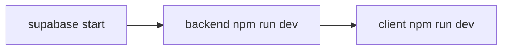

# Contributing to SYNCRO

Thank you for contributing. This guide is the **single onboarding path** for the SYNCRO monorepo: install dependencies, configure environment variables, run local services (client, backend, Supabase), and execute tests.

For package-specific architecture and feature docs, follow the links in [Package-specific guides](#package-specific-guides).

## Monorepo layout

| Package | Path | Role |
|---------|------|------|
| **Client** | [`client/`](./client/) | Next.js frontend (`@syncro/client`) |
| **Backend** | [`backend/`](./backend/) | Express API (`@syncro/backend`) |
| **Shared** | [`shared/`](./shared/) | Shared TypeScript types (`@syncro/shared`) |
| **SDK** | [`sdk/`](./sdk/) | Public TypeScript SDK (`@syncro/sdk`) |
| **Contracts** | [`contracts/`](./contracts/) | Soroban smart contracts (Rust) |
| **Database** | [`supabase/`](./supabase/) | Migrations, seed data, local Supabase config |

npm workspaces connect `backend`, `client`, `sdk`, and `shared`. Install from the **repository root** so `@syncro/shared` links resolve. The client package sets `legacy-peer-deps=true` in [`client/.npmrc`](./client/.npmrc); use `--legacy-peer-deps` at the root for the same effect. `--ignore-scripts` skips the client `preinstall` dep-range check, which flags workspace `*` ranges that npm resolves locally.

## Prerequisites

Install these before cloning:

| Tool | Version | Notes |
|------|---------|-------|
| **Node.js** | 20+ | Required for client, backend, and shared packages |
| **npm** | 10+ (bundled with Node) | Use npm only — do not use yarn or pnpm |
| **Supabase CLI** | latest | Local Postgres, Auth, and Studio |
| **Docker** | latest | Required by Supabase CLI for local stack |
| **Redis** | optional | Enables persistent rate limiting and blockchain DLQ in backend |
| **Rust + Stellar CLI** | optional | Only needed for [`contracts/`](./contracts/) work |

Install the Supabase CLI:

```bash
# macOS / Linux (Homebrew)
brew install supabase/tap/supabase

# Windows (Scoop)
scoop bucket add supabase https://github.com/supabase/scoop-bucket.git
scoop install supabase

# npm (any platform)
npm install -g supabase
```

## Quick start (local development)

Run these steps from a clean clone. They bring up Supabase, the API, and the web app.

```bash
# 1. Clone and install workspace dependencies
git clone https://github.com/Calebux/SYNCRO.git
cd SYNCRO
npm install --legacy-peer-deps --ignore-scripts
npm run build -w shared

# 2. Start local Supabase (Postgres, Auth, Studio)
supabase start

# 3. Apply migrations and seed data
supabase db reset    # migrations + supabase/seed.sql

# 4. Copy env templates
cp backend/.env.example backend/.env
cp client/.env.example client/.env.local

# 5. Fill in Supabase keys from `supabase status`
#    - SUPABASE_URL / NEXT_PUBLIC_SUPABASE_URL → API URL (http://127.0.0.1:54321)
#    - SUPABASE_ANON_KEY / NEXT_PUBLIC_SUPABASE_ANON_KEY → anon key
#    - SUPABASE_SERVICE_ROLE_KEY → service_role key (backend + server-only client routes)
#    Generate secrets: openssl rand -hex 32  (JWT_SECRET, ADMIN_API_KEY, ENCRYPTION_KEY)

# 6. Validate env structure (no real secrets required)
node scripts/check-env-docs.js
node backend/scripts/validate-env.js --structural
node client/scripts/validate-env.js --structural

# 7. Start services (two terminals)
cd backend && npm run dev    # http://localhost:3001
cd client && npm run dev     # http://localhost:3000
```

**Verify the stack**

| Check | URL / command |
|-------|----------------|
| Frontend | http://localhost:3000 |
| Backend health | http://localhost:3001/health |
| API docs | http://localhost:3001/api/docs |
| Supabase Studio | http://localhost:54323 |
| Env docs in sync | `node scripts/check-env-docs.js` |

> **Security:** Never commit `.env`, `.env.local`, or real credentials. Use placeholders in `.env.example` only. The Supabase **service role key** belongs in backend and server-only client code — never in browser-exposed `NEXT_PUBLIC_*` variables.

## Environment variables

Each runtime package owns an env manifest that drives validation and `.env.example` files. See [docs/ENVIRONMENT.md](./docs/ENVIRONMENT.md) for the canonical matrix, naming rules, and how to add a new variable.

| Package | Template | Runtime file | Validate |
|---------|----------|--------------|----------|
| Backend | `backend/.env.example` | `backend/.env` | `npm run validate-env -w backend` |
| Client | `client/.env.example` | `client/.env.local` | `npm run validate-env -w client` |

Minimum required vars to boot locally (full lists live in each manifest):

- **Backend:** `SUPABASE_URL`, `SUPABASE_ANON_KEY`, `SUPABASE_SERVICE_ROLE_KEY`, `JWT_SECRET`, `ADMIN_API_KEY`, SMTP settings, Stellar/Soroban contract settings
- **Client:** `NEXT_PUBLIC_SUPABASE_URL`, `NEXT_PUBLIC_SUPABASE_ANON_KEY`, `NEXT_PUBLIC_API_URL`, Stripe keys

Use `NEXT_PUBLIC_API_URL=http://localhost:3001` so the client talks to the local backend.

## Local services

Start services in this order:



| Service | Command | Default URL |
|---------|---------|-------------|
| Supabase stack | `supabase start` | API `http://127.0.0.1:54321`, Studio `http://localhost:54323` |
| Backend API | `npm run dev -w backend` | http://localhost:3001 |
| Client app | `npm run dev -w client` | http://localhost:3000 |
| Redis (optional) | `redis-server` | `redis://localhost:6379` — set `REDIS_URL` in `backend/.env` |

Useful Supabase commands:

```bash
supabase status          # print local URLs and keys
supabase stop            # stop local containers
supabase db push         # apply pending migrations without reset
```

## Running tests

Run tests from the repository root with workspace flags, or `cd` into each package.

### All packages (type safety)

```bash
npm run typecheck              # all workspaces + root tsconfig
```

### Backend (`backend/`)

```bash
npm test -w backend            # Jest unit/integration tests
npm run test:smoke -w backend  # smoke tests (needs live Supabase + env)
npm run audit:rls:local -w backend  # RLS audit against local Supabase
```

See [docs/SMOKE_TESTS_QUICK_REFERENCE.md](./docs/SMOKE_TESTS_QUICK_REFERENCE.md) for smoke-test setup.

### Client (`client/`)

```bash
npm test -w client             # Vitest unit tests
npm run test:coverage -w client
npm run e2e -w client          # Playwright E2E (needs running app + env)
npm run test:a11y -w client    # accessibility E2E subset
```

See [client/docs/TEST_INFRASTRUCTURE.md](./client/docs/TEST_INFRASTRUCTURE.md) for Vitest and Playwright configuration.

### Shared and SDK

```bash
npm run typecheck -w shared
npm run typecheck -w sdk
npm test -w sdk                # if SDK tests are present
```

### Contracts (Rust / Soroban)

```bash
cd contracts
cargo test
```

See [contracts/README.md](./contracts/README.md) for Stellar CLI setup.

### Repo-wide checks (CI parity)

```bash
node scripts/check-env-docs.js
node scripts/check-contributing.js
node scripts/check-issue-governance.js
```

## Database and migrations

Canonical migrations live in [`supabase/migrations/`](./supabase/migrations/). Legacy SQL under `backend/migrations/` is reference-only.

```bash
# Local: apply all migrations
supabase db push
# or from backend workspace:
npm run db:migrate -w backend

# Reset local DB (migrations + seed.sql)
supabase db reset
# or:
npm run db:reset -w backend

# Create a new migration (timestamp prefix added automatically)
supabase migration new <description>
```

**Naming:** `YYYYMMDDHHMMSS_short_description.sql`

**Single source of truth:** All database schema changes must go through `supabase/migrations/` only. The `backend/migrations/` directory existed previously but has been archived as part of Issue #655 and must not be used for new migrations.

**Rules:**

- Never add `.sql` files directly to `backend/migrations/`. The CI check will fail.
- Never define the same table in both `supabase/migrations/` and anywhere else.
- All tables must have RLS enabled and at least one policy.
- Use `TIMESTAMPTZ` for all timestamp columns, not bare `TIMESTAMP`.
- Blockchain/Soroban timestamps are stored as `BIGINT` Unix epoch seconds; this is intentional.

**Seed data:** `supabase/seed.sql` is for local development and E2E bootstrap only. Never add real emails, payment data, or PII.

**Production:** `npm run db:migrate:prod -w backend` (requires `PRODUCTION_DB_URL`).

**CI:** Pull requests that touch `supabase/migrations/` run [`.github/workflows/database.yml`](./.github/workflows/database.yml) — fresh Supabase stack, `db push`, and SQL lint.

**Why `supabase/migrations/` wins:** SYNCRO uses Supabase as its database provider. The Supabase CLI is the authoritative migration runner. Any migrations run outside it will not be tracked in `supabase_migrations.schema_migrations` and can cause sync errors.

For rollback guidance see [docs/MIGRATION_ROLLBACK_PLAYBOOKS.md](./docs/MIGRATION_ROLLBACK_PLAYBOOKS.md).

## Package-specific guides

Use these for deep dives; the quick start above covers day-to-day local development.

| Package | Guide | Focus |
|---------|-------|-------|
| Backend | [backend/README.md](./backend/README.md) | Routes, jobs, security, Swagger |
| Client | [client/README.md](./client/README.md) | App Router structure, features |
| SDK | [sdk/README.md](./sdk/README.md) | SDK configuration and API |
| Shared | [shared/README.md](./shared/README.md) | Domain types and versioning |
| Contracts | [contracts/README.md](./contracts/README.md) | Soroban build and deploy |
| Environment | [docs/ENVIRONMENT.md](./docs/ENVIRONMENT.md) | Env manifests and CI validation |
| Code review | [docs/code-review-process.md](./docs/code-review-process.md) | Review expectations |

## Branch naming

```
feat/short-description
fix/short-description
chore/short-description
docs/short-description
test/short-description
```

## Pull request guidelines

- Reference the issue: `Closes #<issue-number>`
- Keep PRs focused and reasonably small
- Include a **test plan** (steps reviewers can follow)
- Ensure CI passes: typecheck, tests, env structural checks

## Code standards

### TypeScript

- No `any` types
- Avoid unsafe non-null assertions (`!`)

### Security

- No hardcoded secrets — use env vars and `.env.example` placeholders
- Validate inputs (Zod on backend routes)
- Never expose service role keys or secrets via `NEXT_PUBLIC_*`

### Testing

Add or update tests for:

- New API endpoints
- Bug fixes
- Business logic changes

## Before you open a pull request

- [ ] `npm run typecheck` passes
- [ ] Package tests pass (`npm test -w backend`, `npm test -w client` as applicable)
- [ ] `node scripts/check-env-docs.js` passes (if env files changed)
- [ ] Environment variables documented in manifests and `.env.example`
- [ ] No secrets in committed files
- [ ] PR description and test plan completed

## Clean-machine verification checklist

Use this checklist on a fresh machine (or new VM) to confirm the guide works:

1. Install prerequisites (Node 20+, Docker, Supabase CLI)
2. Clone repo and run `npm install --legacy-peer-deps --ignore-scripts` at repo root, then `npm run build -w shared`
3. Run `supabase start` then `supabase db reset`
4. Copy `backend/.env.example` → `backend/.env` and `client/.env.example` → `client/.env.local`
5. Paste keys from `supabase status`; set `NEXT_PUBLIC_API_URL=http://localhost:3001`
6. Run structural env checks (see [Quick start](#quick-start-local-development))
7. Start backend and client; confirm health endpoints respond
8. Run `npm test -w backend` and `npm test -w client`

## Issue delivery notes

Long-form implementation artifacts, summaries, or delivery notes belong in [`docs/archive/`](./docs/archive/) — not the repository root.

## Additional resources

- [PR Submission Guide](./docs/archive/PR_SUBMISSION_GUIDE.md)
- [RLS Audit Guide](./docs/RLS_AUDIT_GUIDE.md)
- [Branch Protection](./docs/branch-protection.md)
- [GitHub CODEOWNERS](./.github/CODEOWNERS)

## Questions?

1. Search [existing issues](https://github.com/Calebux/SYNCRO/issues)
2. Open a new issue with reproduction steps
3. Ask in your pull request or issue thread

## Code of conduct

- Be respectful and professional
- Give constructive review feedback
- Help newer contributors learn the codebase
- Report conduct concerns to maintainers
