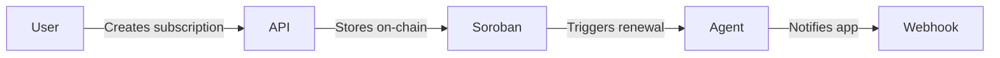

## What is SYNCRO?

SYNCRO is a decentralised subscription management platform built on the **Stellar** blockchain. It lets you:

- Track all your subscriptions in one place
- Automate renewals via **Soroban smart contracts**
- Integrate third-party apps through our **REST API** and **SDK**
- Receive real-time event notifications via **webhooks**

## How It Works

1. **Create** a subscription via the REST API or SDK
2. SYNCRO stores the subscription data on-chain via the Soroban contract
3. When renewal is due, the agent contract triggers the payment
4. Your app receives a webhook event for each state change

## Key Concepts

| Concept | Description |
|---------|-------------|
| **Subscription** | A recurring payment tracked on Stellar |
| **Agent** | Authorised contract that can trigger renewals |
| **Webhook** | HTTP callback sent on subscription events |
| **API Key** | Bearer token used to authenticate API calls |

## Next Steps

<CardGroup cols={2}>
  <Card title="Quickstart" icon="rocket" href="/quickstart">
    Make your first API call in under 5 minutes
  </Card>
  <Card title="Authentication" icon="key" href="/authentication">
    Learn how to authenticate API requests
  </Card>
  <Card title="API Reference" icon="code" href="/api-reference/subscriptions">
    Explore the full REST API
  </Card>
  <Card title="SDK Reference" icon="cube" href="/sdk-reference">
    Use the TypeScript SDK
  </Card>
</CardGroup>
